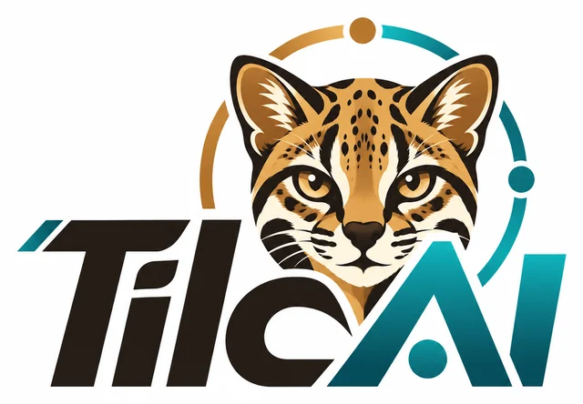
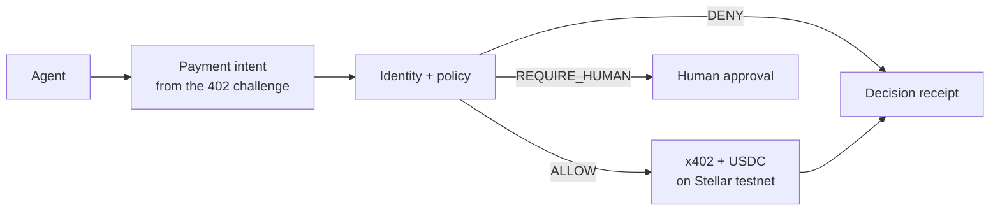

  

<h3 align="center">Give agents purchasing power. Keep humans in control.</h3>

  
  
  

---

**TilcAI** is an SDK and gateway, in development, for spending policies and trust signals in payments between AI agents — starting on **Stellar**.

Before an agent pays, TilcAI checks **who** gets paid, **for what** and **within which budget**. Then it allows, blocks or asks a human — and keeps a signed receipt of every decision, including refusals.

> [!IMPORTANT]
> TilcAI is early-stage. There is no deployed contract, no published package and no live service yet. Everything below describes what we are building.

## The problem

Agents can already discover and pay for APIs and tools with [x402](https://developers.stellar.org/docs/build/agentic-payments/x402). But a funded wallet is not a mandate:

- **Budgets multiply** — three sub-agents with a 1 USDC limit each can spend 3 USDC, not 1.
- **Limits ignore the purchase** — a per-payment cap does not stop a small payment to a cloned endpoint or a swapped recipient.
- **Instructions can be hijacked** — prompt injection or a retry loop can change the amount, the recipient, or repeat a purchase.
- **No one can explain the payment** — a transaction hash proves a transfer, not who authorised it or why another one was refused.

## How it is meant to work

- **Shared budget tree on Soroban** — a principal funds a root budget and splits it into sub-mandates; a child can never exceed its parent.
- **Deterministic policies** — the model proposes, rules decide. Price and recipient come from the service's 402 challenge, never from model output. Anything unverifiable is denied.
- **Trust signals v0** — a signed provider profile, buyer feedback tied to a paid receipt, and a narrow validation of response format and freshness. Inspired by the concepts of [ERC-8004](https://eips.ethereum.org/EIPS/eip-8004); not an implementation of it.
- **Decision receipts** — signed, with reason codes, for every yes and every no.

## Roadmap

| Stage | Scope | Status |
| --- | --- | --- |
| **Stellar Elite** · mid-October 2026 | Buyer base: budget tree contract (testnet), policy gateway, SDK + MCP tool, reference paid service, receipts, trust signals v0 | In development |
| **HackMeridian** · Oct 25–26, 2026 | Seller extension: signed offers verified against a trusted key and the 402 challenge | Planned · subject to event acceptance |
| **Vision** | Agent-to-business commerce: bookings, cancellations and refunds between agents of people and small businesses | Not scheduled |

A signature alone never authorises a payment: the buyer also checks that the seller's key was already trusted, that the terms match the 402 challenge, and that the spending policy still allows it.

## Planned stack

`Stellar Testnet` · `Soroban` · `USDC (SEP-41)` · `x402 exact` · `TypeScript` · `MCP` · `Next.js`

Listing a technology does not imply partnership, sponsorship or a finished integration. No support for other networks is claimed.

## Repositories

Repositories will appear here as they are published. Each one states clearly what is implemented and what is still planned.

---

<b>Español</b>

**TilcAI** es un SDK y gateway en desarrollo para políticas de gasto y señales de confianza en pagos entre agentes de IA, empezando por **Stellar**. Antes de que un agente pague, TilcAI comprueba a quién se paga, por qué y con qué presupuesto; luego permite, bloquea o pide aprobación humana, y guarda un recibo firmado de cada decisión, incluidos los rechazos.

Es un proyecto en etapa temprana: todavía no hay contrato desplegado, paquete publicado ni servicio en producción. La base compradora se construye en el bootcamp **Stellar Elite** (mediados de octubre de 2026) y la ampliación con ofertas firmadas de negocios está prevista para **HackMeridian** (25–26 de octubre de 2026), sujeta a la aceptación en el evento.

