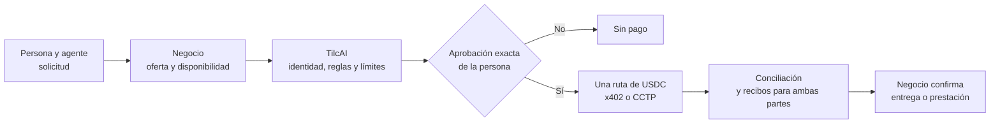

  <picture>
    <source media="(prefers-color-scheme: dark)" srcset="./tilcai-logo-white.webp">
    
  </picture>

<h1 align="center">Comercio verificable para la era de los agentes</h1>

<strong>Tu agente ayuda a comprar. Tú decides cuándo y cuánto pagar. El negocio puede comprobar el resultado.</strong>

  <a href="https://www.tilcai.xyz/">Sitio web</a> ·
  <a href="https://github.com/TilcAI/documentation/blob/main/0-OFICIAL/CONTEXTO_OFICIAL_TILCAI.md">Documentación</a> ·
  <a href="https://github.com/orgs/TilcAI/projects/1">Avances</a> ·
  <a href="https://t.me/+CfbYnvPNXTo2OGMx">Comunidad</a>

  
  
  

---

## ¿Qué es TilcAI?

TilcAI desarrolla infraestructura para que **agentes de personas y negocios puedan coordinar una compra sin confundir una conversación con una autorización de pago**. El agente puede solicitar un producto o servicio; el negocio responde con precio, vigencia y destino de cobro; la persona aprueba las condiciones exactas; y TilcAI conecta esa decisión con un pago en USDC y su evidencia.

La operación debe responder tres preguntas para ambas partes:

- **Identidad y autoridad:** ¿qué persona o negocio participa y quién puede aprobar el gasto? Una wallet o passkey puede vincular una autorización, pero **no equivale por sí sola a una verificación legal de identidad o KYC**.
- **Validación:** ¿el precio, el destinatario, la vigencia y los límites coinciden con lo aprobado?
- **Resultado y reputación:** ¿se pagó realmente y qué comprobantes lo demuestran? Construir reputación a partir de operaciones verificables es una **dirección de producto**, no una capacidad ya desplegada.

**Ejemplo:** «Compra 20 bolsas de cemento». El agente del comprador pide cotizaciones. Un negocio confirma precio y disponibilidad. La persona aprueba una oferta concreta. TilcAI ejecuta **un solo intento de pago** por una ruta compatible, reconcilia el resultado y entrega referencias a ambas partes. El negocio confirma el retiro o la entrega **por separado**: pagar no demuestra que el producto se entregó.

## De una intención a dos comprobantes

> **Alcance del diagrama:** describe el flujo comercial que estamos integrando. Las pruebas de pagos descritas abajo **no significan** que toda esta compra, desde la cotización hasta la entrega, ya esté operativa en MAINNET.

### Las dos rutas de pago

| Ruta | Cuándo se usaría | Estado |
| --- | --- | --- |
| **Stellar + x402** | El USDC ya está en Stellar y se solicita un pago directo por un recurso o servicio. | Experimentos aislados en testnet; el pago comercial integrado con USDC **no está habilitado en MAINNET**. |
| **Circle CCTP V2** | El USDC nativo está en otra red compatible y debe llegar a Stellar. Circle coordina la quema, atestación y emisión en destino. | **Avalanche C-Chain → Stellar Public Network probado con fondos reales en un piloto limitado.** |

Son rutas **alternativas para una operación**, no dos cargos. CCTP transporta USDC nativo; no convierte cualquier token ni dinero fiat.

## MAINNET: qué se ha demostrado

El equipo documentó una instancia separada para **Avalanche C-Chain y Stellar Public Network**, además de la instancia de **Avalanche Fuji y Stellar Testnet**. El corredor principal usa USDC nativo, Circle CCTP V2 y un relayer que puede patrocinar el gas para el pagador.

En el piloto del **10 de octubre de 2026** se registraron dos transferencias de **0,01 USDC** de Avalanche a Stellar, una de ellas iniciada por la API de TilcAI. Después, el equipo mostró en una demo una transferencia **gasless de 1 USDC** hacia una cuenta usada por Vaquita: el flujo llegó a `SETTLED`, la aplicación mostró **1,00 USD de fondos disponibles** y posteriormente una posición de **0,99 USD en Ahorros**. La causa de esa diferencia de 0,01 USD no está determinada; la grabación tampoco demuestra rendimientos ganados.

[Consulta el registro técnico del piloto](https://github.com/TilcAI/documentation/blob/main/2-ARQUITECTURA/TILCAI_MAINNET_Y_TESTNET_SIMULTANEOS_2026-10-10.md) y el [estado de despliegue y riesgos](https://github.com/TilcAI/tilcai-infrastructure/blob/main/deploy/MAINNET_DEPLOYMENT.md). Los importes, estados y capturas de la demo fueron aportados por el equipo; **este perfil no sustituye una verificación independiente de cada transacción y del abono en Vaquita**.

> [!IMPORTANT]
> **MAINNET probado no significa producto listo para operar a escala.** El corredor se probó con importes pequeños. Los contratos propios no cuentan con auditoría independiente; faltan endurecimiento del relayer, infraestructura de datos y pruebas de recuperación y concurrencia. Las cuentas inteligentes, vaults y x402 comercial permanecen deshabilitados en la instancia MAINNET. No presentamos el QR simulado como depósito fiat real.

## Estado del producto

| Componente | Estado comprobable |
| --- | --- |
| **USDC Avalanche → Stellar** | Corredor CCTP probado en testnet y en un piloto limitado de MAINNET. |
| **Wallet con passkey en Telegram** | Mini App y smart account en **Stellar Testnet**; no es una wallet multired ni una wallet MAINNET pública. |
| **Oferta, aprobación y orden comercial** | Piezas técnicas y flujos de demostración; la compra completa entre agente comprador y negocio sigue en integración. |
| **MCP para asistentes** | Trabajo de integración; una conexión MCP no concede por sí misma permiso para gastar. |
| **Web interactiva** | Explica y simula el producto. Sus escenas no representan transacciones reales del visitante. |
| **Reputación verificable** | Objetivo de producto basado en identidad, validación y recibos; aún no es un sistema de puntuación operativo. |

Ningún modelo de IA obtiene autoridad para mover fondos solo por redactar un pedido. Una decisión de política favorable tampoco es una firma, una transferencia o una confirmación de entrega.

## Repositorios

| Repositorio | Responsabilidad |
| --- | --- |
| [`tilcai-infrastructure`](https://github.com/TilcAI/tilcai-infrastructure) | API, workers, conciliación, relayer y corredor USDC Avalanche → Stellar. |
| [`tilcai-core`](https://github.com/TilcAI/tilcai-core) | Contratos de datos, reglas de autoridad e investigación de rieles de pago. |
| [`tilcai-cctp-engine`](https://github.com/TilcAI/tilcai-cctp-engine) | Laboratorio de CCTP y matriz de rutas; una ruta modelada no implica un corredor comercial activo. |
| [`tilcai-web`](https://github.com/TilcAI/tilcai-web) | Sitio, demostraciones interactivas y visualización del producto. |
| [`documentation`](https://github.com/TilcAI/documentation) | Contexto oficial, arquitectura, decisiones y trabajo pendiente. |

## Qué estamos construyendo ahora

1. Conectar un negocio piloto con catálogo, disponibilidad, cotización versionada y destino de cobro registrado.
2. Vincular la aprobación humana de **importe, activo, red, destinatario y vencimiento** con una orden y un único intento de pago.
3. Entregar recibos coherentes a comprador y negocio, conciliados con las pruebas de origen y destino; registrar la entrega como evento distinto.
4. Revisar de forma independiente los contratos y reforzar firmantes, permisos, persistencia y recuperación antes de ampliar el uso de MAINNET.

## Construyamos juntos

Buscamos negocios con casos de uso concretos, desarrolladores y personas que quieran probar el flujo y revisar su evidencia.

**[Web](https://www.tilcai.xyz/)** · **[X](https://x.com/tilcai_ai)** · **[Instagram](https://www.instagram.com/tilcai/)** · **[Comunidad de Telegram](https://t.me/+CfbYnvPNXTo2OGMx)** · **[Tablero de trabajo](https://github.com/orgs/TilcAI/projects/1)**

<strong>English summary</strong>

TilcAI is building commerce infrastructure for buyer and merchant agents. A merchant provides an offer; the buyer approves exact terms; TilcAI applies rules, coordinates one USDC payment route and reconciles evidence for both sides. A limited **Avalanche C-Chain → Stellar Public Network MAINNET** CCTP pilot has moved real USDC, including a team-recorded 1 USDC deposit flow into Vaquita. This verifies a payment component, **not** an end-to-end merchant purchase or production readiness. Passkey wallets currently run on Stellar Testnet; merchant checkout, MAINNET x402 and reputation derived from verified receipts remain in development. [Read the technical record](https://github.com/TilcAI/tilcai-infrastructure/blob/main/deploy/MAINNET_DEPLOYMENT.md).

TilcAI es un proyecto independiente. Mencionar Stellar, Circle, Avalanche o Vaquita describe tecnología o pruebas; no implica respaldo comercial de esas organizaciones.

