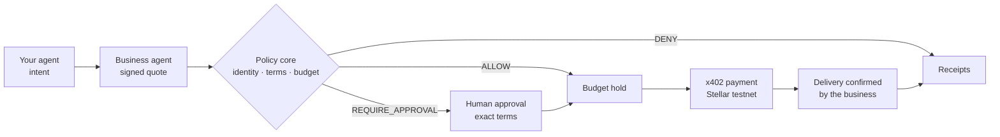

  <picture>
    <source media="(prefers-color-scheme: dark)" srcset="./tilcai-logo-white.webp">
    
  </picture>

<h3 align="center">Your agent buys. Your business responds. You stay in control.</h3>

  
  
  

---

**TilcAI** is agent-to-business commerce infrastructure in development, starting on **Stellar**. It connects the agent acting for a person or organization with the agent of a business so they can inquire, quote, book and buy, with limited authority, verifiable terms and payments on Stellar.

The agent interprets the request. The business answers from its own system. TilcAI decides what the agent is allowed to do: it checks identity, terms, policy and budget, asks for human approval when needed, and keeps separate evidence of the decision, the payment and the delivery.

> [!IMPORTANT]
> TilcAI is early-stage. **There is no enabled purchase flow, deployed contract, published SDK, running MCP server or live payment service.** The office on the website is a local simulation that moves no funds. An `ALLOW` decision from the prototype does not authorise a transfer.

  
   
  The website's first screen: a simulated office where every room is a piece of TilcAI. Figures, IDs and ledger numbers are illustrative.

## What exists today

| Component | State | What it is, and what it is not |
| --- | --- | --- |
| **[Website](https://tilcai.vercel.app/en)** ([EN](https://tilcai.vercel.app/en) · [ES](https://tilcai.vercel.app/es)) | Available | Bilingual site with a full-screen agent-office simulation (intent → quote → policy → approval → x402 payment → receipt), a policy scenario demo and the proposed architecture. It runs in the browser and calls neither `tilcai-core` nor a payment network. |
| **Policy evaluator** (`tilcai-core`) | Available · prototype | Tested TypeScript function that checks limits, recipient, network and asset, and returns `ALLOW` or `DENY` with a reason code. `ALLOW` means the policy passed, nothing more. |
| **Shared contracts** (`tilcai-core`) | Available · in team review | Versioned types for IDs, states, errors, intent, mandate, exact approval bindings and twelve MCP tools. They keep decision, payment and delivery as separate states. |
| **x402 payment rail** | Available · component | Payment verification and settlement through an OpenZeppelin Relayer. A Testnet payment was confirmed on-chain, and repeating the same payload did not pay twice. Not yet connected to quotes, approvals or orders; the test used the network's native asset, not USDC. |

## The problem

Assistants can already find services and pay for APIs with [x402](https://developers.stellar.org/docs/build/agentic-payments/x402). Delegating a real purchase needs more than a funded wallet:

- **Terms come from the business, not the model** — price, availability and payee must be verified against the business's own system and a trusted key.
- **A wallet is not a mandate** — the user has to decide how much an agent may spend, with whom, on what, and when it must ask.
- **Several agents, one budget** — three sub-agents with a 1 USDC limit each can spend 3 USDC, not 1.
- **Instructions can be hijacked** — prompt injection or a retry loop can change the amount or the payee, or repeat a purchase.
- **A transfer is not a delivery** — a transaction hash proves a payment, not who authorised it, why another one was refused, or whether the service was delivered.

## How it is meant to work

- **Deterministic policies** — the model proposes, rules decide. Amount and payee come from verified terms, never from model output. Anything unverifiable is denied.
- **Approval per purchase first** — the user authorises the exact terms. Limited delegation through smart accounts comes later, once account, signer and rail are tested together.
- **Shared budget** — limits and holds coordinated across agents, so they cannot spend the same funds twice.
- **Separate evidence** — decision, payment and delivery each keep their own record, refusals included.

## Build status

We build around capabilities, not promises, and publish no fixed dates.

| Stage | Capabilities |
| --- | --- |
| **Available** | Website and simulation · policy evaluator · shared contracts · x402 rail with OpenZeppelin Relayer on Testnet |
| **In integration** | MCP connector and assistant guides · quotes, orders and commercial adapter · approval per purchase · payment reconciliation and delivery |
| **Next** | Smart accounts with limited permissions · shared budget across agents · scheduled tasks and more clients or providers |

An item moves to another stage only with evidence in its stated environment. The live status, with a maintainer per item, is on the website's [progress section](https://tilcai.vercel.app/en#roadmap).

## Planned stack

`Stellar Testnet` · `Soroban` · `USDC` · `x402` · `OpenZeppelin Relayer` · `MCP` · `TypeScript` · `Next.js`

Listing a technology does not imply partnership, sponsorship or a finished integration. No support for other networks is claimed.

## Repositories

| Repository | Current scope | Access |
| --- | --- | --- |
| [`tilcai-web`](https://github.com/TilcAI/tilcai-web) | Public website: office simulation, policy demo, proposed architecture | Public |
| `tilcai-core` | Policy evaluator and shared contracts with tests; no payment integration | Private to the team for now |

The website and the core are separate today. Connecting them is future work, not a current feature.

---

<b>Español</b>

**TilcAI** es una infraestructura en desarrollo para el comercio entre agentes, empezando por **Stellar**. Conecta el agente de una persona u organización con el agente de una empresa para consultar, cotizar, reservar y comprar con autoridad limitada, condiciones verificables y pagos sobre Stellar. El agente interpreta la solicitud, la empresa responde desde su propio sistema y TilcAI decide qué puede hacer el agente: verifica identidad, condiciones, política y presupuesto, pide aprobación humana cuando corresponde y guarda evidencias separadas de la decisión, el pago y la entrega.

Hoy existen la [web pública](https://tilcai.vercel.app/es), con una oficina de agentes simulada a pantalla completa (sin fondos, no llama a `tilcai-core` ni a una red de pagos); el evaluador de políticas y los contratos compartidos en `tilcai-core` (privado por ahora); y un riel de pago x402 con OpenZeppelin Relayer probado en Testnet, todavía sin conectar a cotizaciones, aprobaciones ni órdenes. No hay un flujo de compra habilitado, contrato desplegado, SDK publicado, servidor MCP en funcionamiento ni servicio en producción. El estado de cada capacidad, sin fechas fijas, se publica en la [sección de avance](https://tilcai.vercel.app/es#roadmap) de la web.

