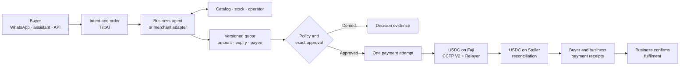
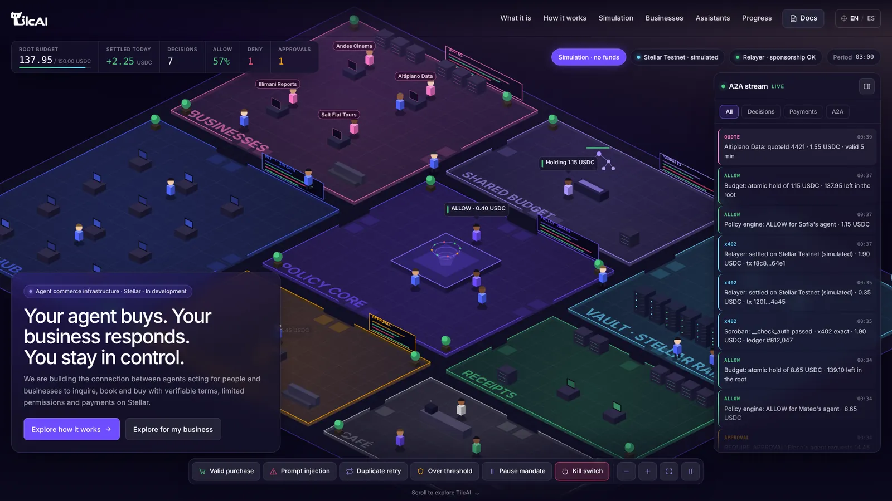

  <picture>
    <source media="(prefers-color-scheme: dark)" srcset="./tilcai-logo-white.webp">
    
  </picture>

<h1 align="center">Commerce infrastructure for agents and businesses</h1>

<strong>Your agent buys. Your business responds. You stay in control.</strong>

  <a href="https://tilcai.vercel.app/en">Explore the interactive website</a> ·
  <a href="https://github.com/TilcAI/documentation/blob/main/0-OFICIAL/CONTEXTO_OFICIAL_TILCAI.md">Read the architecture</a> ·
  <a href="https://github.com/orgs/TilcAI/projects/1/views/1">Follow the build</a>

  
  
  

---

### The idea in one transaction

> **“Buy 20 bags of cement.”** The buyer's agent should be able to ask several businesses, receive a quote backed by actual stock and a registered payee, request approval for the exact terms, pay once, and return a verifiable receipt. The business should see the same order and confirm pickup or delivery separately.

Today, an assistant can compose that request. The hard part is turning it into an **authorized, priced, payable and auditable operation** across a buyer, a business and a payment network. That is the infrastructure TilcAI is building.

**TilcAI connects the buyer's agent to a business agent or adapter.** The business remains the source of truth for price and availability. TilcAI applies identity, policy, limits and human approval; coordinates a supported USDC payment route; then reconciles payment evidence with the order. A model never gets spending authority merely because it can write a message.

### From intent to receipt

*This is the target **integrated purchase flow**. The Fuji → Stellar payment route works in testnet; the merchant, approval, channel and order integrations are being built. A payment receipt is not proof of delivery.*

  
   
  Interactive office on the website. Its agents, metrics and transactions are simulated; this screen moves no funds.

### What we can show today

| Evidence | State | Where to inspect it |
| --- | --- | --- |
| **USDC Avalanche Fuji → Stellar Testnet** through Circle CCTP V2, with an OpenZeppelin Relayer sponsoring the tested gasless path | **Implemented and verified as a payment component in testnet**; a purchase order is not connected yet | [`tilcai-infrastructure`](https://github.com/TilcAI/tilcai-infrastructure) · [technical flow](https://github.com/TilcAI/tilcai-infrastructure#flujo-de-la-fase-1) |
| **x402 on Stellar** through the Relayer | **Tested separately with the network's native asset**; USDC and the end-to-end order flow still need verification | [`tilcai-core` payment-rail guide](https://github.com/TilcAI/tilcai-core/blob/main/docs/payment-rail-reproducibility.md) |
| **Policy checks, shared IDs and state contracts** | **Code and tests exist**; `ALLOW` is a policy decision, not a signature or transfer | [`tilcai-core`](https://github.com/TilcAI/tilcai-core) |
| **Eight-network CCTP laboratory** | **Route research, code and verification matrix**; this does not mean eight TilcAI purchase routes are live | [`tilcai-cctp-engine`](https://github.com/TilcAI/tilcai-cctp-engine) |
| **Bilingual website and agent-office demo** | **Interactive simulation**, separate from the payment backend | [`tilcai-web`](https://github.com/TilcAI/tilcai-web) · [website](https://tilcai.vercel.app/en) |
| **WhatsApp purchase demonstration on 2 October** | **Shown by the team** with payment confirmation and explorer links; a reusable TilcAI channel adapter is still in progress | [Project context and evidence levels](https://github.com/TilcAI/documentation/blob/main/0-OFICIAL/CONTEXTO_OFICIAL_TILCAI.md) |

### What we're connecting next

1. **Merchant side:** a pilot business agent or adapter returns a versioned quote from a controlled catalog, with availability and a registered payee.
2. **Buyer control:** persist the order, enforce policy and bind a human approval to its exact amount, asset, network, destination and expiry.
3. **Payment and evidence:** link one approved order to one payment attempt, reconcile Fuji and Stellar references, and send consistent receipts to both sides. Fulfilment remains a separate business confirmation.
4. **Access:** bring the existing WhatsApp channel into the common API, then expose the same operation to assistants through MCP. Account issuance through a secure link, additional networks and a fiat on-ramp are subsequent integrations.

The [build board](https://github.com/orgs/TilcAI/projects/1/views/1) shows owners and progress. The [integration plan and demo criteria](https://github.com/TilcAI/documentation/blob/main/2-ARQUITECTURA/TILCAI_FLUJO_INTEGRADO_Y_DEMO_2026-10-08.md) define what counts as an end-to-end proof.

> [!IMPORTANT]
> **Testnet only.** A verified cross-chain transfer is not yet a completed agent purchase. The website does not move funds. Wallet creation through WhatsApp, a BOB ↔ USDC ramp, a published SDK, and production purchasing are not available today.

### Explore the project

| Repository | Responsibility |
| --- | --- |
| [`tilcai-web`](https://github.com/TilcAI/tilcai-web) | Product story, interactive office and simulation |
| [`tilcai-core`](https://github.com/TilcAI/tilcai-core) | Shared contracts, authority rules and payment-rail experiments |
| [`tilcai-infrastructure`](https://github.com/TilcAI/tilcai-infrastructure) | API, worker, Relayer integration and Fuji → Stellar USDC route |
| [`tilcai-cctp-engine`](https://github.com/TilcAI/tilcai-cctp-engine) | Cross-chain research and route matrix |
| [`documentation`](https://github.com/TilcAI/documentation) | [Official context](https://github.com/TilcAI/documentation/blob/main/0-OFICIAL/CONTEXTO_OFICIAL_TILCAI.md), [architecture](https://github.com/TilcAI/documentation/tree/main/2-ARQUITECTURA) and [assigned backlog](https://github.com/TilcAI/documentation/blob/main/3-CONSTRUCCION/ISSUES_PROPUESTAS_2026-10-08.md) |

Want to reproduce the payment component? Start with the [infrastructure README](https://github.com/TilcAI/tilcai-infrastructure#uso), its unit tests and typecheck. An on-chain test additionally needs testnet accounts, USDC, a configured Relayer and the environment described there; **never commit keys or seeds**.

<strong>En español — qué es TilcAI</strong>

 

**TilcAI construye la infraestructura para que agentes de personas y negocios puedan concretar compras, reservas y pagos con reglas claras.** El agente comprador expresa la intención; el negocio responde con una cotización basada en su catálogo y un destino de cobro registrado; TilcAI comprueba identidad, condiciones, límites y aprobación, coordina el pago y conserva evidencias distintas de decisión, liquidación y entrega.

El corredor **USDC Avalanche Fuji → Stellar Testnet** ya se implementó y probó como componente. Todavía estamos conectando el agente del negocio, la orden, la aprobación exacta, WhatsApp y los recibos de ambos lados para demostrar una compra completa. La [web interactiva](https://tilcai.vercel.app/es) es una simulación sin fondos. El [contexto oficial](https://github.com/TilcAI/documentation/blob/main/0-OFICIAL/CONTEXTO_OFICIAL_TILCAI.md) separa lo implementado, lo verificado, lo mostrado por el equipo y lo pendiente.

Built for the Stellar Starmaker hackathon. Technologies named here describe integrations, not endorsements or partnerships.

